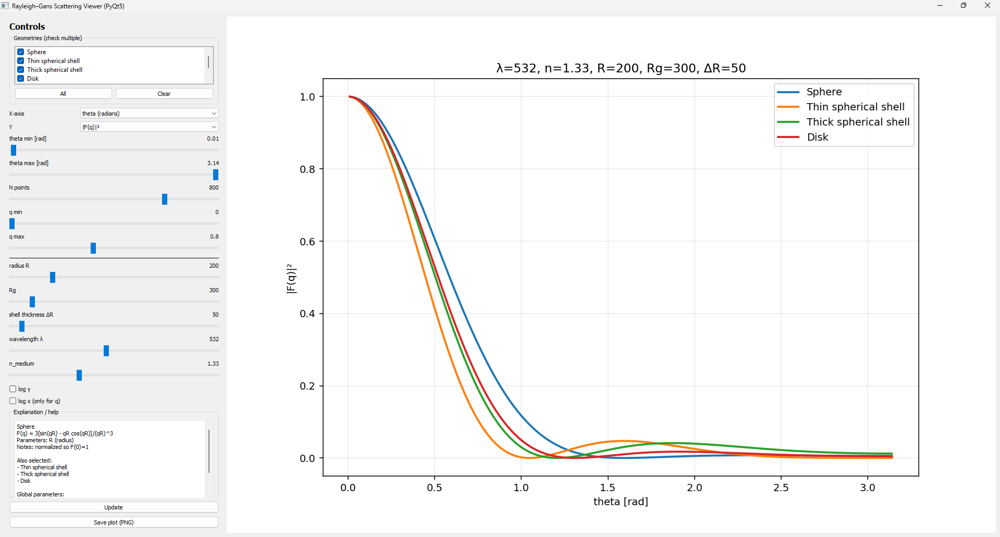

## Quick start (GUI)
```bash
python run_app.py
```

## Overview

This repository provides analytic form factors for Rayleigh–Gans scattering
(spheres, shells, disks, and polymer models), together with an interactive
PyQt5 application for visualizing how these form factors depend on particle
size, wavelength, and scattering vector q.

## Physics notes

- All angles are in radians.
- The scattering vector is defined as  
  q = 2k sin(θ/2), with k = 2πn/λ.
- |F(q)|² corresponds to the scattering intensity.
- Gaussian coil (Debye) and Guinier models are intensity-only.

## Implemented models

- Sphere
- Thin spherical shell
- Thick spherical shell
- Disk (2D)
- Gaussian polymer coil (Debye)
- Guinier approximation