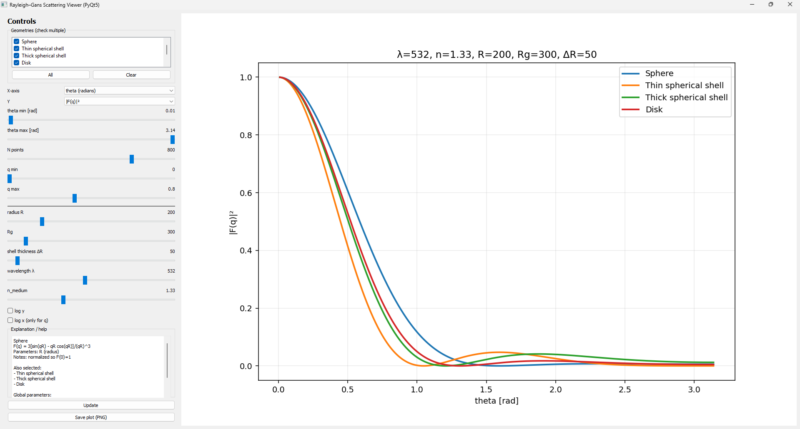

# Rayleigh-Gans Scattering Viewer



Interactive tools for exploring analytic form factors in the Rayleigh-Gans regime.
The repository combines:

- A PyQt5 desktop viewer for quick visual comparisons
- Reusable analytic form-factor functions in `src/rayleigh_gans/form_factors.py`
- Jupyter notebooks for derivations, examples, and reproducible figures

## Features

- Compare multiple geometries in the same plot
- Switch between plotting versus scattering angle `theta` or scattering vector `q`
- Inspect amplitude views `Re[F(q)]`, `|F(q)|`, and intensity `|F(q)|^2`
- Explore both particle and polymer models from the same interface
- Export figures directly to PNG

## Implemented models

- Sphere
- Thin spherical shell
- Thick spherical shell
- Disk (2D quick-look model)
- Gaussian polymer coil (Debye)
- Guinier approximation

## Installation

### Option 1: Install as a package

```bash
pip install -e .
```

This installs the `rayleigh_gans` package and the console script:

```bash
rayleigh-gans-viewer
```

You can also launch it with:

```bash
python -m rayleigh_gans
```

### Option 2: Install from requirements

```bash
pip install -r requirements.txt
```

This is enough to run the current app launcher:

```bash
python run_app.py
```

### Development / notebooks

```bash
pip install -r requirements-dev.txt
```

or:

```bash
pip install -e .[dev]
```

## Running the viewer

From the repository root, choose one of:

```bash
python run_app.py
```

```bash
python -m rayleigh_gans
```

```bash
rayleigh-gans-viewer
```

## Running the tests

The current test suite uses the standard library `unittest` framework:

```bash
python -m unittest discover -s tests -v
```

To run the form-factor tests directly:

```bash
python -m unittest tests.test_form_factors -v
```

## Notebook usage

The notebooks in `Notebooks/` use `Notebooks/_bootstrap.py` to locate `src/`
without requiring installation first. That makes it easy to experiment locally
while still keeping the package layout clean.

## Physics notes

- All angles are in radians unless otherwise stated.
- The scattering vector is defined as `q = 2k sin(theta/2)` with `k = 2*pi*n / wavelength`.
- `|F(q)|^2` corresponds to the scattering intensity.
- Debye and Guinier are intensity-only models in this repository.
- Length units should be kept consistent across particle size, `Rg`, and `wavelength`.

## Repository layout

```text
.
|-- docs/
|-- Notebooks/
|-- src/
|   `-- rayleigh_gans/
|       |-- app/
|       |-- form_factors.py
|       `-- main.py
|-- tests/
|-- pyproject.toml
|-- requirements.txt
`-- run_app.py
```

## Possible next extensions

- Orientation-averaged disk or rod models
- Additional polymer / aggregate form factors
- Preset parameter bundles for common scattering scenarios
- Figure export presets for publication-quality output
